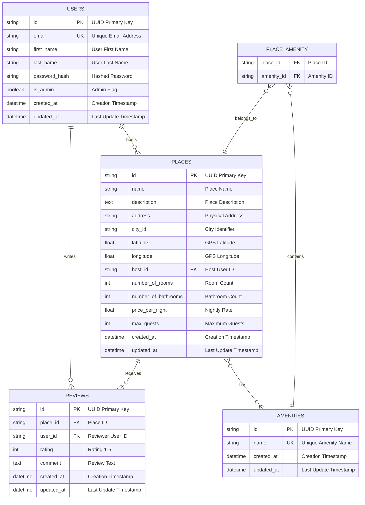

# HBnB Database Entity-Relationship Diagram

**Author**: Gabriel Garcia Muniz  
**GitHub**: [https://github.com/GG-Muniz](https://github.com/GG-Muniz)  
**Created with**: Mermaid.js

## Complete ER Diagram

This diagram shows all entities, their attributes, and relationships in the HBnB database schema.

## Relationship Summary

### One-to-Many Relationships
- **User → Places**: One user can host multiple places
- **User → Reviews**: One user can write multiple reviews  
- **Place → Reviews**: One place can have multiple reviews

### Many-to-Many Relationships
- **Place ↔ Amenities**: Places can have multiple amenities, amenities can belong to multiple places (via association table)

### Key Constraints
- Each review must be unique per user-place combination
- All foreign keys have cascade delete enabled
- Email addresses and amenity names must be unique
- Ratings are constrained to values 1-5
- Geographic coordinates are validated within proper ranges

---

**Created by Gabriel Garcia Muniz** | [GitHub](https://github.com/GG-Muniz) | Holberton School 2024