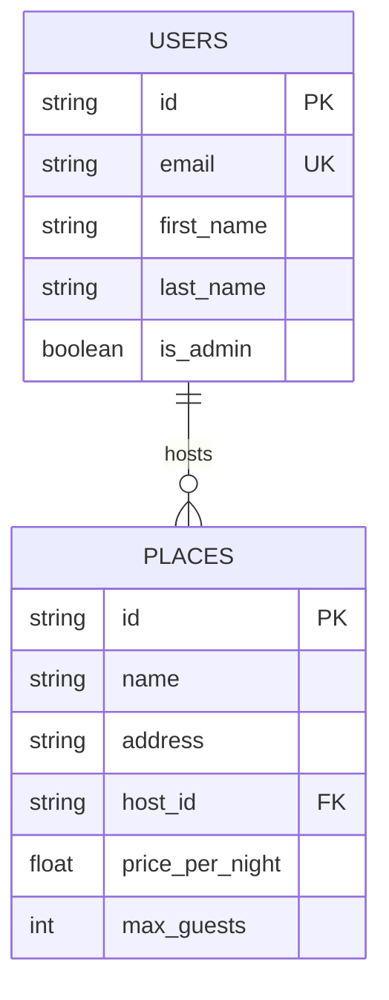
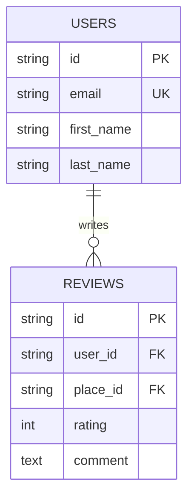
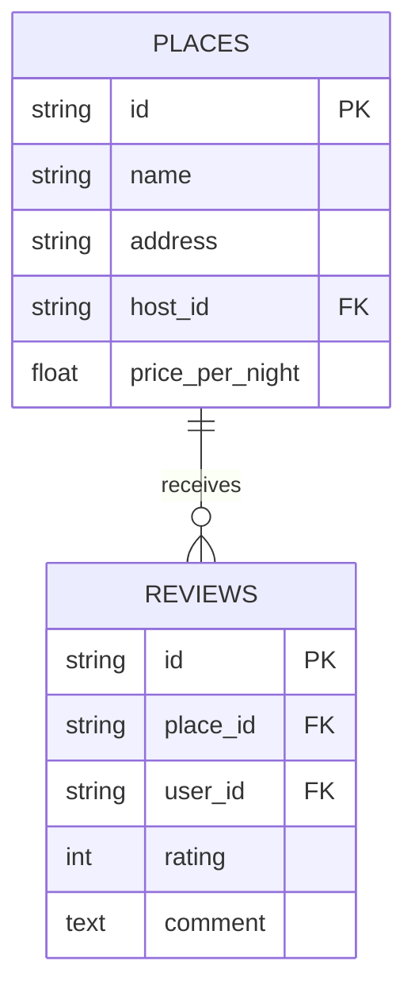
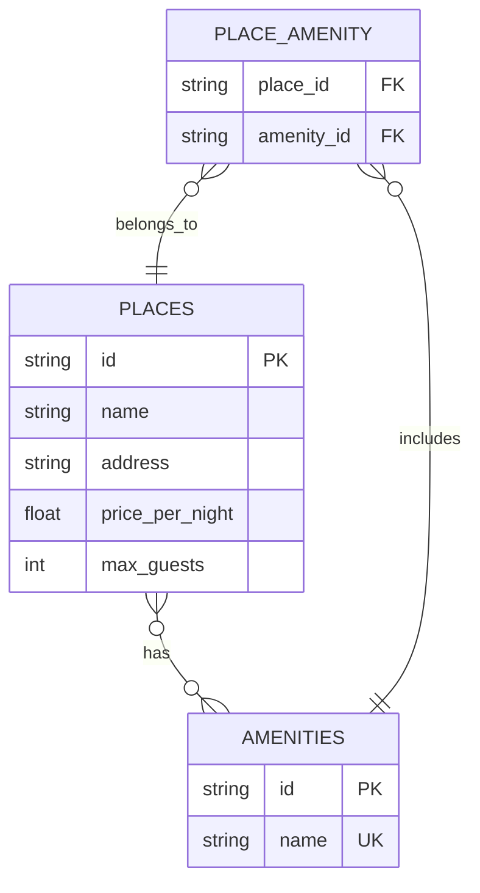
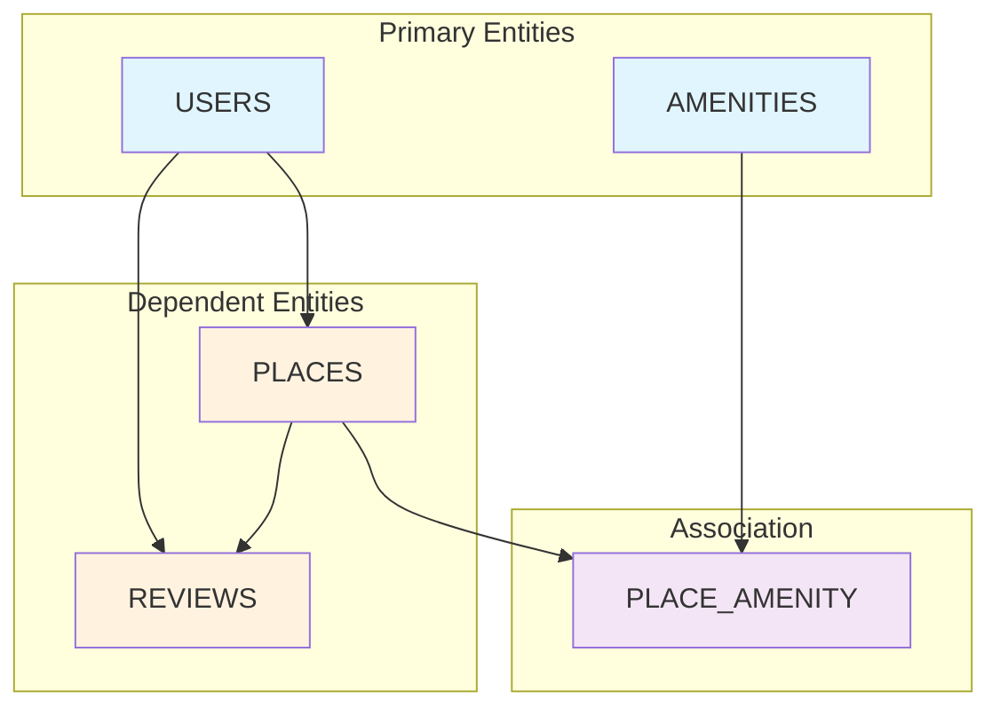
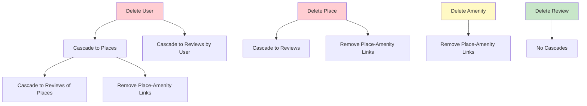
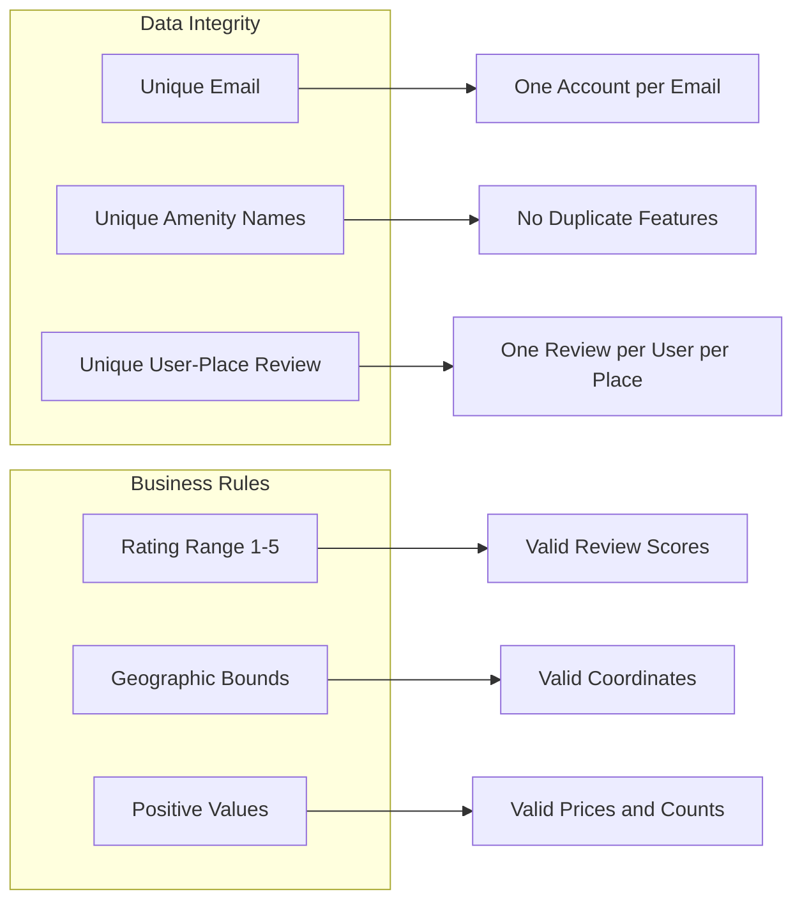
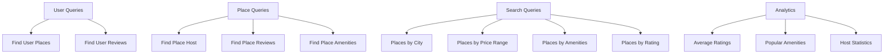

# HBnB Database Relationship Diagrams

**Author**: Gabriel Garcia Muniz  
**GitHub**: [https://github.com/GG-Muniz](https://github.com/GG-Muniz)  
**Created with**: Mermaid.js

## Relationship Types and Patterns

### One-to-Many Relationships

#### User-Places Relationship (Host → Properties)

**Relationship Details:**
- **Type**: One-to-Many
- **Description**: One user can host multiple places
- **Foreign Key**: `places.host_id` → `users.id`
- **Cascade**: ON DELETE CASCADE (deleting user removes their places)
- **Business Rule**: Every place must have exactly one host

---

#### User-Reviews Relationship (Reviewer → Reviews)

**Relationship Details:**
- **Type**: One-to-Many
- **Description**: One user can write multiple reviews
- **Foreign Key**: `reviews.user_id` → `users.id`
- **Cascade**: ON DELETE CASCADE (deleting user removes their reviews)
- **Business Rule**: Each user can only review a place once

---

#### Place-Reviews Relationship (Property → Reviews)

**Relationship Details:**
- **Type**: One-to-Many
- **Description**: One place can receive multiple reviews
- **Foreign Key**: `reviews.place_id` → `places.id`
- **Cascade**: ON DELETE CASCADE (deleting place removes its reviews)
- **Business Rule**: Reviews are tied to specific places

---

### Many-to-Many Relationship

#### Place-Amenities Relationship (Properties ↔ Features)

**Relationship Details:**
- **Type**: Many-to-Many
- **Description**: Places can have multiple amenities, amenities can belong to multiple places
- **Association Table**: `place_amenity`
- **Composite Key**: `(place_id, amenity_id)`
- **Cascade**: ON DELETE CASCADE for both foreign keys
- **Business Rule**: Flexible amenity assignments per property

---

## Complete Relationship Flow

### Data Flow and Dependencies

**Dependency Order:**
1. **Independent**: Users, Amenities (can exist without others)
2. **Dependent**: Places (require Users as hosts)
3. **Highly Dependent**: Reviews (require both Users and Places)
4. **Association**: Place_Amenity (requires both Places and Amenities)

---

## Cascade Delete Behavior

### Delete Impact Analysis

**Cascade Rules:**
- **User Deletion**: Removes all hosted places, all user reviews, and related associations
- **Place Deletion**: Removes all place reviews and amenity associations
- **Amenity Deletion**: Only removes associations with places
- **Review Deletion**: No cascade effects (safest operation)

---

## Constraint Relationships

### Business Logic Constraints

**Constraint Types:**
- **Uniqueness**: Prevent data duplication
- **Range Validation**: Ensure realistic values
- **Referential Integrity**: Maintain relationship consistency
- **Business Logic**: Enforce application rules

---

## Query Pattern Optimization

### Common Query Patterns

**Optimized Access Patterns:**
- **User-centric**: Quick access to user's places and reviews
- **Place-centric**: Efficient retrieval of place details and relationships
- **Search-optimized**: Fast filtering by location, price, features
- **Analytics-ready**: Aggregation queries for business insights

---

**Created by Gabriel Garcia Muniz** | [GitHub](https://github.com/GG-Muniz) | Holberton School 2024