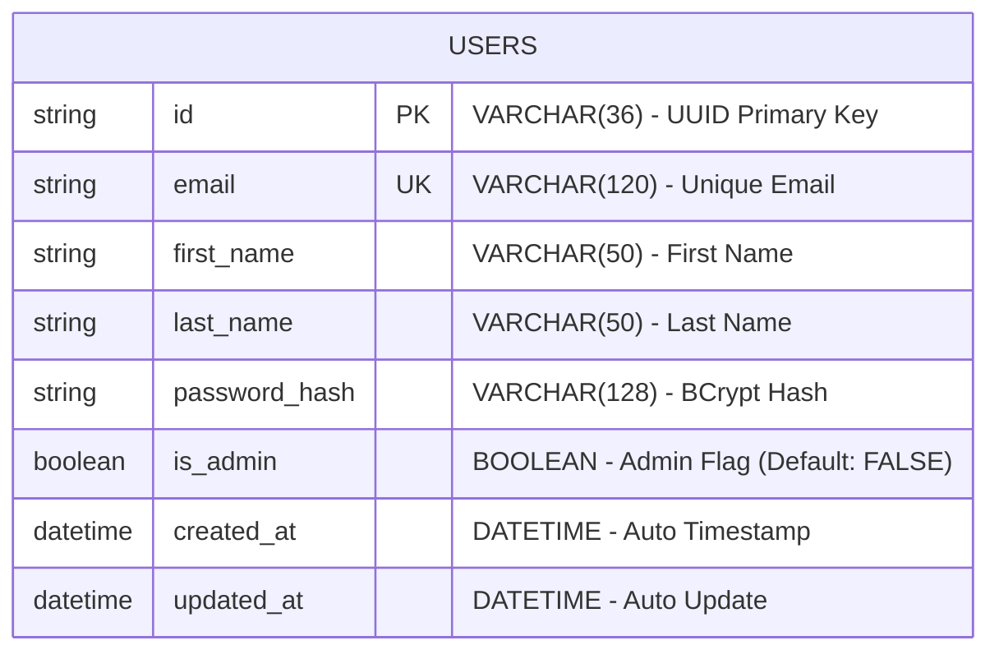
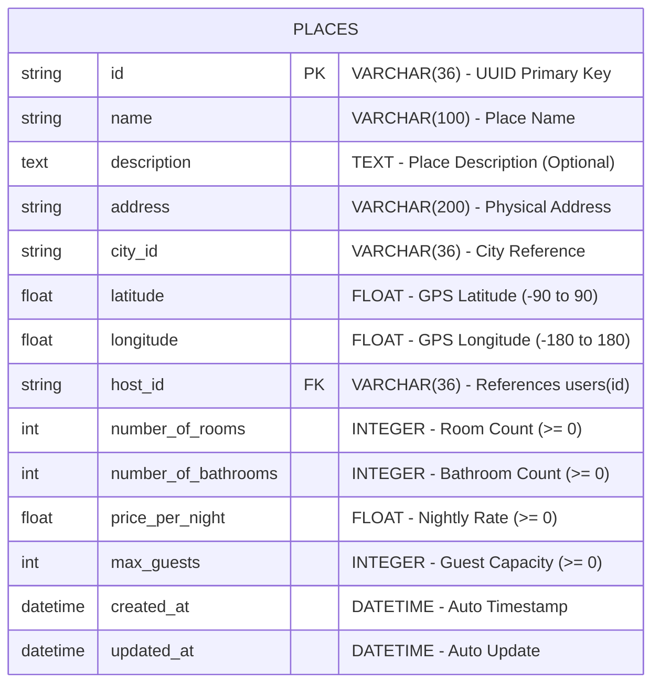
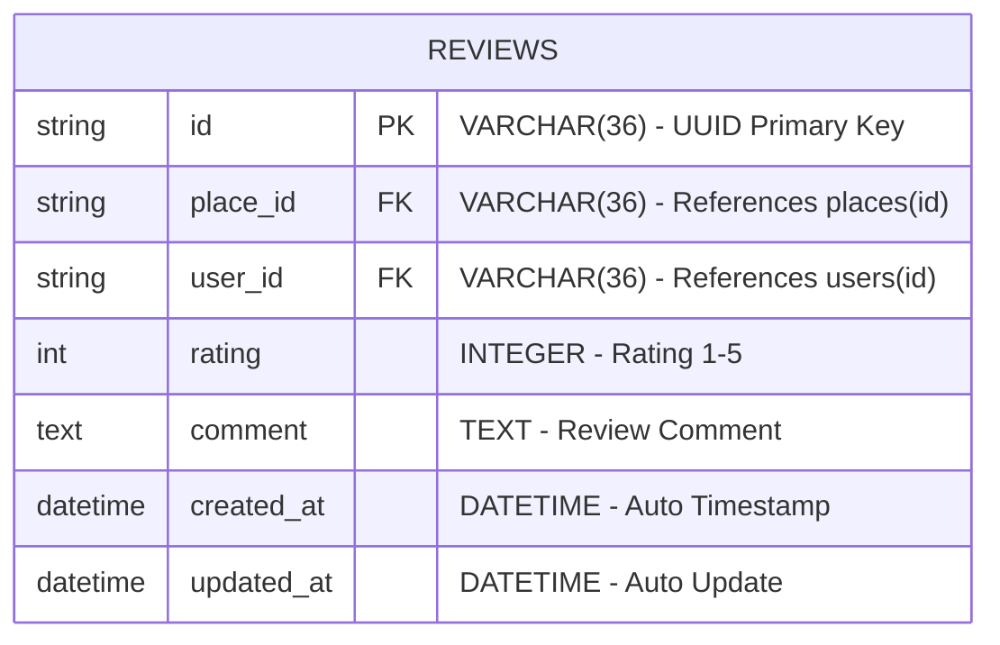
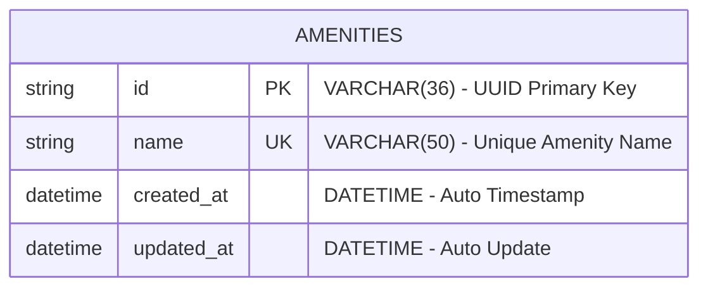
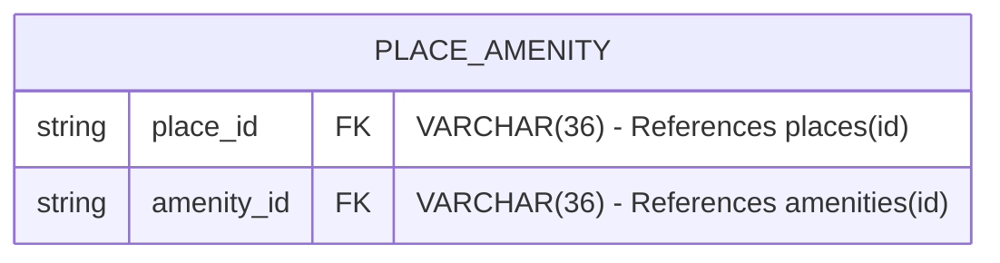
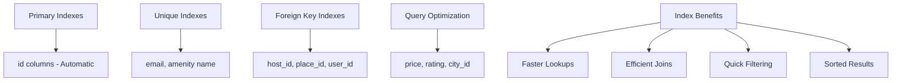

# HBnB Database Table Structure Diagrams

**Author**: Gabriel Garcia Muniz  
**GitHub**: [https://github.com/GG-Muniz](https://github.com/GG-Muniz)  
**Created with**: Mermaid.js

## Individual Table Structures

### Users Table Structure

**Constraints:**
- Primary Key: `id`
- Unique Key: `email`
- Not Null: `email`, `first_name`, `last_name`, `is_admin`, `created_at`, `updated_at`
- Index: `idx_users_email`

---

### Places Table Structure

**Constraints:**
- Primary Key: `id`
- Foreign Key: `host_id` → `users(id)` ON DELETE CASCADE
- Check Constraints:
  - `latitude BETWEEN -90 AND 90`
  - `longitude BETWEEN -180 AND 180`
  - `price_per_night >= 0`
  - `number_of_rooms >= 0`
  - `number_of_bathrooms >= 0`
  - `max_guests >= 0`
- Indexes: `idx_places_host_id`, `idx_places_city_id`, `idx_places_price`

---

### Reviews Table Structure

**Constraints:**
- Primary Key: `id`
- Foreign Keys:
  - `place_id` → `places(id)` ON DELETE CASCADE
  - `user_id` → `users(id)` ON DELETE CASCADE
- Unique Constraint: `(user_id, place_id)` - One review per user per place
- Check Constraint: `rating BETWEEN 1 AND 5`
- Indexes: `idx_reviews_place_id`, `idx_reviews_user_id`, `idx_reviews_rating`

---

### Amenities Table Structure

**Constraints:**
- Primary Key: `id`
- Unique Key: `name`
- Not Null: `name`, `created_at`, `updated_at`
- Index: `idx_amenities_name`

---

### Place-Amenity Association Table Structure

**Constraints:**
- Composite Primary Key: `(place_id, amenity_id)`
- Foreign Keys:
  - `place_id` → `places(id)` ON DELETE CASCADE
  - `amenity_id` → `amenities(id)` ON DELETE CASCADE
- Indexes: `idx_place_amenity_place_id`, `idx_place_amenity_amenity_id`

---

## Data Types Summary

| Column Type | SQL Type | Description | Constraints |
|-------------|----------|-------------|-------------|
| UUID | VARCHAR(36) | Unique identifiers | Primary/Foreign keys |
| Email | VARCHAR(120) | Email addresses | Unique, indexed |
| Name/Text Short | VARCHAR(50-200) | Names, addresses | Not null where required |
| Description | TEXT | Long text content | Optional |
| Numbers | INTEGER/FLOAT | Counts, prices, coordinates | Check constraints for ranges |
| Timestamps | DATETIME | Created/updated times | Auto-generated |
| Flags | BOOLEAN | True/false values | Default values |

---

## Index Strategy

### Performance Optimization Indexes

**Indexing Strategy:**
- **Primary Keys**: Automatic unique indexes on all `id` columns
- **Foreign Keys**: Indexes on all FK columns for join performance
- **Unique Constraints**: Indexes on `email` and `amenity.name`
- **Query Optimization**: Additional indexes on frequently filtered columns

---

**Created by Gabriel Garcia Muniz** | [GitHub](https://github.com/GG-Muniz) | Holberton School 2024