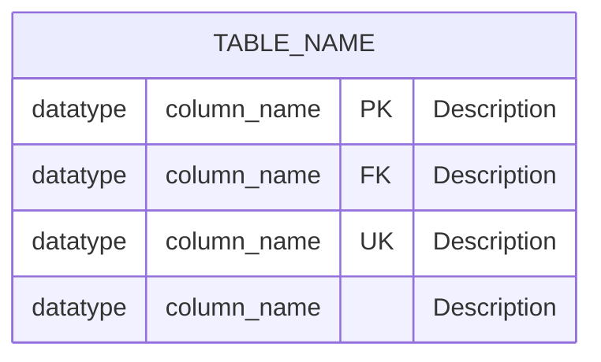

# HBnB Database Diagrams Documentation

**Author**: Gabriel Garcia Muniz  
**GitHub**: [https://github.com/GG-Muniz](https://github.com/GG-Muniz)  
**Project**: HBnB Database Visualization with Mermaid.js

## Overview

This directory contains comprehensive Entity-Relationship (ER) diagrams for the HBnB (Holberton BnB) application database schema, created using Mermaid.js. These diagrams provide visual representations of the database structure, relationships, and constraints.

## File Structure

```
part3/
├── database_er_diagram.md          # Main ER diagram with all entities
├── table_structure_diagrams.md     # Detailed table structures
├── relationship_diagrams.md        # Focused relationship views
└── DATABASE_DIAGRAMS_README.md     # This documentation file
```

## Diagram Types

### 1. Main ER Diagram (`database_er_diagram.md`)

**Purpose**: Provides a comprehensive overview of the entire database schema

**Contents**:
- All 5 entities (Users, Places, Reviews, Amenities, Place_Amenity)
- Complete attribute listings with data types
- All relationships with cardinality indicators
- Primary and foreign key designations

**Best Used For**:
- Understanding the complete system architecture
- Database design reviews
- System documentation
- New developer onboarding

### 2. Table Structure Diagrams (`table_structure_diagrams.md`)

**Purpose**: Detailed breakdown of individual table structures

**Contents**:
- Individual table schemas with full attribute details
- Data type specifications and constraints
- Index definitions and optimization strategies
- Constraint documentation (CHECK, UNIQUE, NOT NULL)

**Best Used For**:
- Database implementation
- Performance optimization
- Data validation understanding
- Migration script creation

### 3. Relationship Diagrams (`relationship_diagrams.md`)

**Purpose**: Focused views on specific relationship patterns

**Contents**:
- One-to-Many relationship examples
- Many-to-Many relationship implementation
- Cascade delete behavior visualization
- Query optimization patterns

**Best Used For**:
- Understanding relationship mechanics
- Debugging foreign key issues
- Query optimization planning
- Business logic implementation

## Entity Descriptions

### Users Table
- **Purpose**: Store user account information and authentication data
- **Key Features**: Unique email addresses, password hashing, admin flags
- **Relationships**: Hosts places, writes reviews

### Places Table
- **Purpose**: Store property listings with location and pricing details
- **Key Features**: Geographic coordinates, pricing, capacity details
- **Relationships**: Belongs to user (host), has reviews, has amenities

### Reviews Table
- **Purpose**: Store user feedback and ratings for places
- **Key Features**: 1-5 rating scale, unique user-place combinations
- **Relationships**: Written by user, applies to place

### Amenities Table
- **Purpose**: Store available features/amenities for places
- **Key Features**: Unique amenity names, reusable across properties
- **Relationships**: Many-to-many with places

### Place_Amenity Table
- **Purpose**: Association table for many-to-many place-amenity relationships
- **Key Features**: Composite primary key, cascade delete
- **Relationships**: Links places with their amenities

## Relationship Types

### One-to-Many Relationships

#### User → Places (Host Relationship)
```
One user can host multiple places
- Foreign Key: places.host_id → users.id
- Cascade: Delete user removes all their places
- Business Rule: Every place has exactly one host
```

#### User → Reviews (Reviewer Relationship)
```
One user can write multiple reviews
- Foreign Key: reviews.user_id → users.id
- Cascade: Delete user removes all their reviews
- Business Rule: One review per user per place
```

#### Place → Reviews (Property Review Relationship)
```
One place can receive multiple reviews
- Foreign Key: reviews.place_id → places.id
- Cascade: Delete place removes all its reviews
- Business Rule: Reviews tied to specific properties
```

### Many-to-Many Relationships

#### Place ↔ Amenities (Feature Assignment)
```
Places can have multiple amenities, amenities can belong to multiple places
- Association Table: place_amenity
- Composite Key: (place_id, amenity_id)
- Cascade: Delete either entity removes associations
- Business Rule: Flexible amenity assignments
```

## Constraint Implementation

### Primary Key Constraints
- All tables use UUID strings (VARCHAR(36)) as primary keys
- Ensures global uniqueness and distributed system compatibility

### Foreign Key Constraints
- All relationships implemented with proper foreign keys
- CASCADE DELETE maintains referential integrity
- Prevents orphaned records

### Unique Constraints
- `users.email`: Prevents duplicate accounts
- `amenities.name`: Prevents duplicate amenity definitions
- `reviews(user_id, place_id)`: One review per user per place

### Check Constraints
- `reviews.rating`: Values between 1 and 5
- `places.latitude`: Values between -90 and 90
- `places.longitude`: Values between -180 and 180
- `places.price_per_night`: Non-negative values
- Room/bathroom/guest counts: Non-negative integers

### Index Strategy
```
Performance Indexes:
- Primary keys: Automatic unique indexes
- Foreign keys: Indexes for join optimization
- Email: Unique index for user lookups
- Amenity names: Index for feature searches
- Place attributes: Indexes for filtering (price, location)
- Review attributes: Indexes for analytics (rating, place)
```

## Mermaid.js Syntax Guide

### Basic ER Diagram Structure


### Relationship Notation
- `||--o{`: One-to-Many (one-to-zero-or-more)
- `}o--o{`: Many-to-Many
- `||--||`: One-to-One
- `||--o|`: One-to-Zero-or-One

### Key Indicators
- `PK`: Primary Key
- `FK`: Foreign Key
- `UK`: Unique Key

## Viewing the Diagrams

### Online Viewing
1. **Mermaid Live Editor**: https://mermaid-live.github.io/
   - Copy diagram code from markdown files
   - Paste into the editor for interactive viewing
   - Export as PNG/SVG for presentations

2. **GitHub Integration**:
   - GitHub automatically renders Mermaid diagrams in markdown
   - View diagrams directly in the repository

3. **VS Code Extension**:
   - Install "Mermaid Markdown Syntax Highlighting"
   - Preview diagrams directly in the editor

### Local Viewing
```bash
# Install Mermaid CLI
npm install -g @mermaid-js/mermaid-cli

# Generate PNG from diagram
mmdc -i database_er_diagram.md -o database_diagram.png

# Generate SVG from diagram
mmdc -i database_er_diagram.md -o database_diagram.svg
```

## Integration with Development

### SQLAlchemy Model Alignment
The diagrams accurately reflect the SQLAlchemy models in the application:
- Table names match `__tablename__` attributes
- Column types align with SQLAlchemy column definitions
- Relationships match `relationship()` configurations
- Constraints reflect model validation rules

### SQL Script Alignment
The diagrams correspond to the SQL scripts:
- `schema.sql`: Implements the exact table structures shown
- `data.sql`: Populates tables following the relationship rules
- `test_crud_operations.sql`: Tests the relationships depicted

### API Development Reference
Use these diagrams when:
- Designing API endpoints (understand data relationships)
- Writing database queries (optimize using relationship knowledge)
- Implementing business logic (respect constraint requirements)
- Debugging data issues (trace relationship dependencies)

## Best Practices

### Diagram Maintenance
1. **Keep Updated**: Update diagrams when schema changes
2. **Version Control**: Include diagrams in git commits
3. **Review Process**: Include diagram updates in code reviews
4. **Documentation**: Reference diagrams in API documentation

### Usage Guidelines
1. **Start with Main ER**: Get overall understanding
2. **Drill into Details**: Use table structure diagrams for implementation
3. **Focus on Relationships**: Use relationship diagrams for complex queries
4. **Reference Constraints**: Check constraint details for validation logic

### Common Pitfalls
1. **Diagram Drift**: Ensure diagrams stay synchronized with actual schema
2. **Over-complexity**: Keep diagrams readable, split complex views
3. **Missing Context**: Include business rules and constraint explanations
4. **Tool Limitations**: Understand Mermaid syntax limitations

## Troubleshooting

### Diagram Rendering Issues
- **Problem**: Diagram not rendering in GitHub
- **Solution**: Check Mermaid syntax, ensure proper code block formatting

- **Problem**: Complex diagram too large to read
- **Solution**: Split into multiple focused diagrams

- **Problem**: Relationship lines overlapping
- **Solution**: Reorganize entity order, use simpler relationship notation

### Schema Inconsistencies
- **Problem**: Diagram doesn't match actual database
- **Solution**: Compare with `schema.sql` and SQLAlchemy models

- **Problem**: Missing relationships in diagram
- **Solution**: Check all foreign key definitions in SQL and models

## Future Enhancements

### Potential Additions
1. **Data Flow Diagrams**: Show how data moves through the system
2. **Query Execution Plans**: Visualize common query patterns
3. **Performance Diagrams**: Show index usage and optimization
4. **Migration Diagrams**: Visualize schema evolution over time

### Advanced Features
1. **Interactive Diagrams**: Clickable elements for deeper exploration
2. **Automated Generation**: Scripts to generate diagrams from schema
3. **Validation Tools**: Automated checking of diagram-schema consistency
4. **Integration Testing**: Verify relationships through automated tests

This documentation provides a comprehensive guide to understanding and using the HBnB database diagrams for development, maintenance, and system understanding.

---

**Created by Gabriel Garcia Muniz** | [GitHub](https://github.com/GG-Muniz) | Holberton School 2024